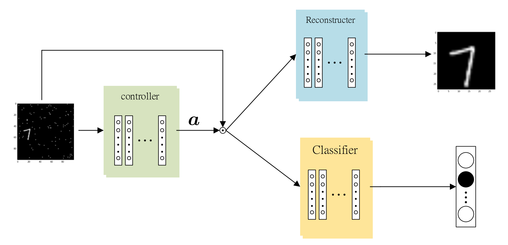
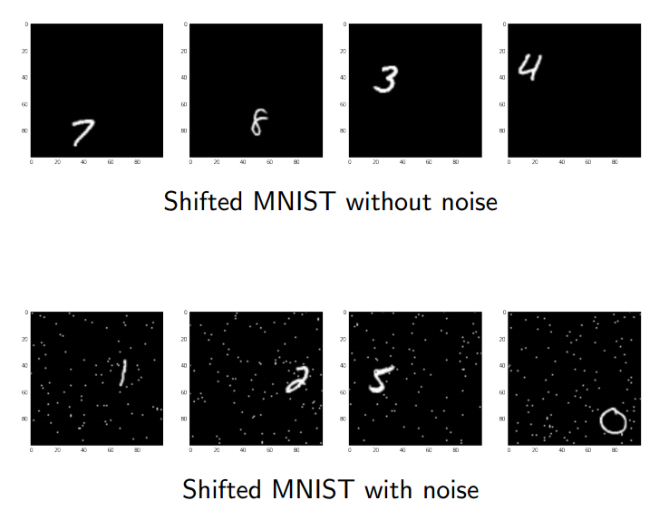
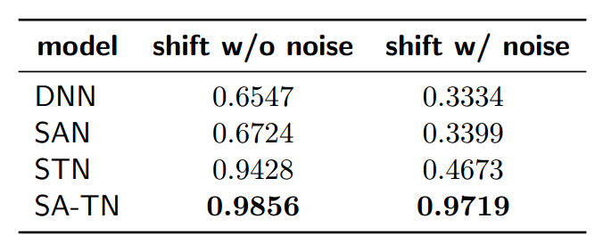

# Deep Supporting Attention in Transformer Network for Image Recognition
In this project, we introduce Supporting Attention into Transformer Network.
We evalute this model on Shift-Noised MNIST dataset

## Setting 
- Hardware:
    - RAM: DDR3-1600 64G
    - GPU: NVIDIA GTX 1080ti 11G

- Keras

## Data example

## Result
- Classification Accuracies (\%) 

